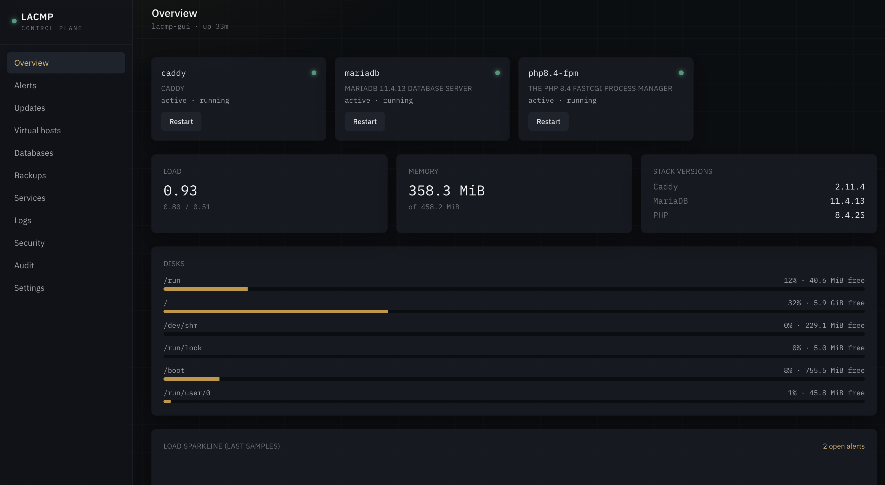
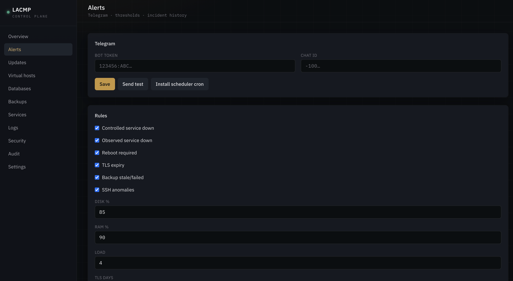
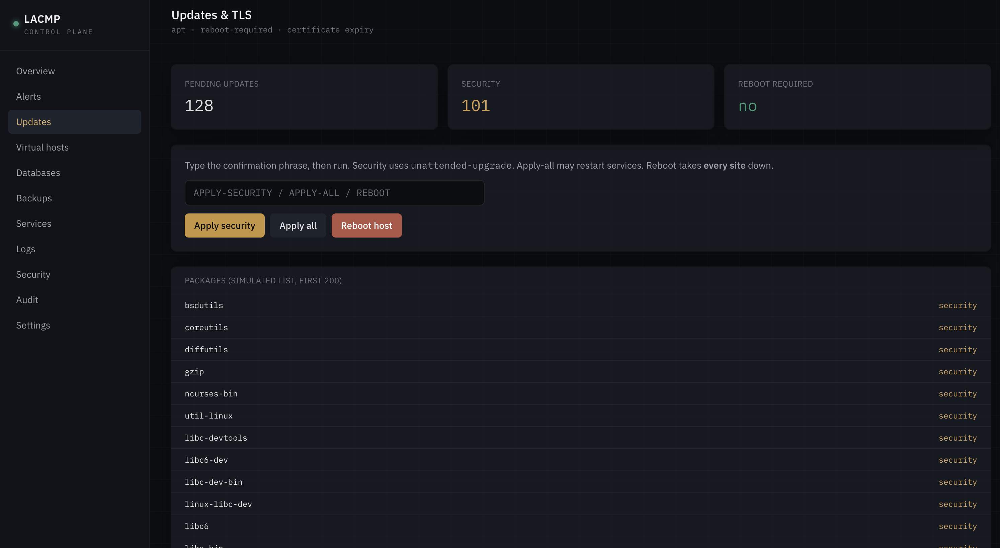
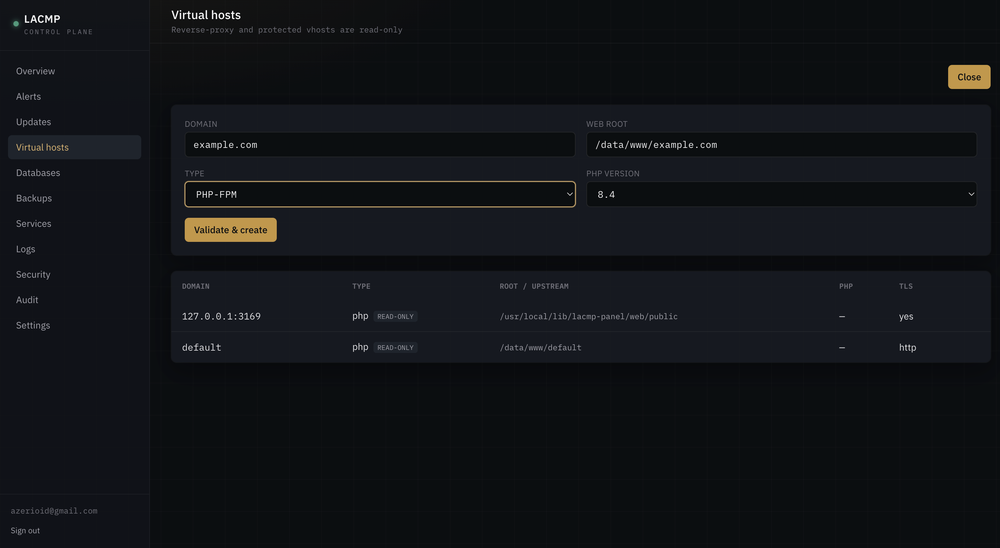
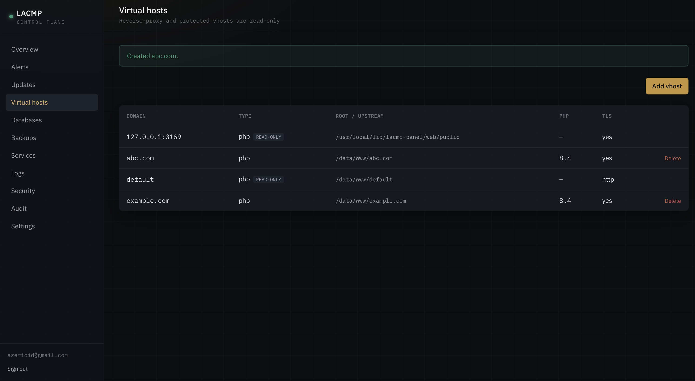
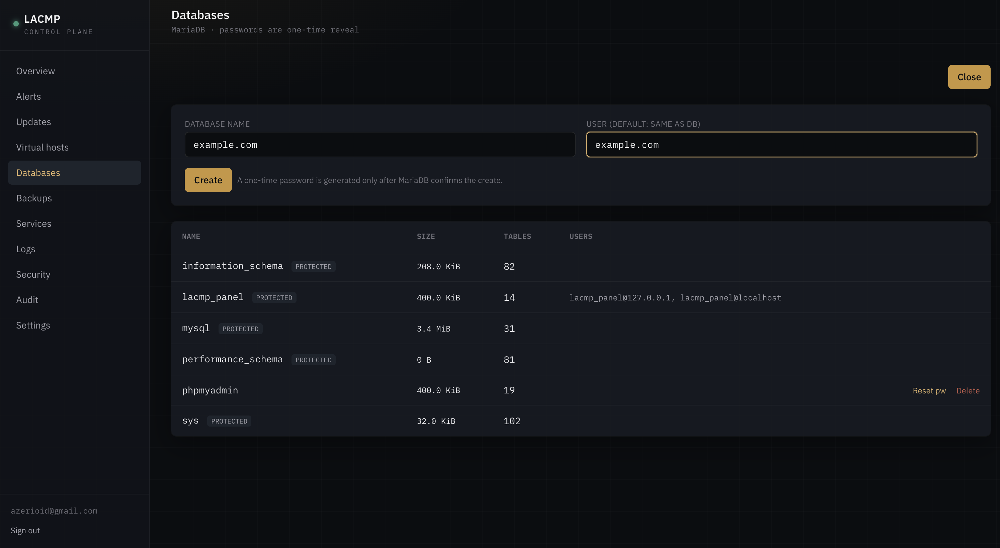
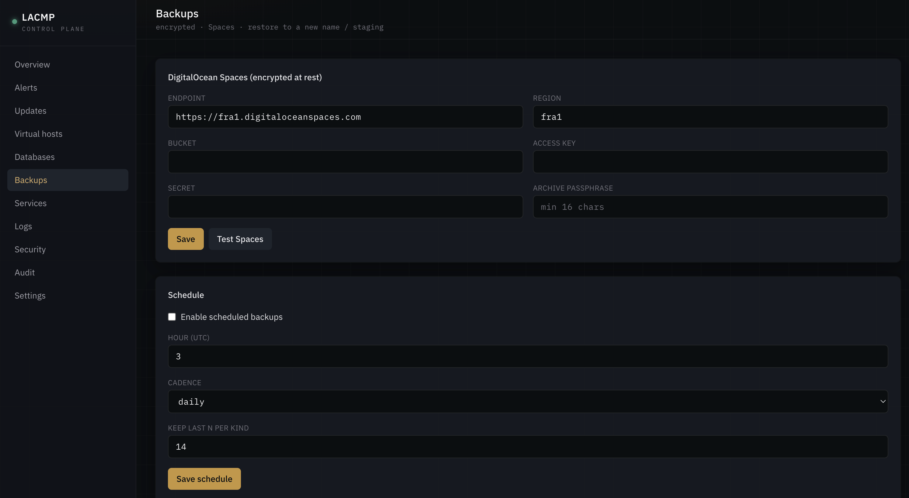
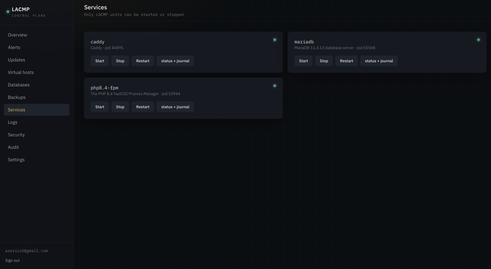
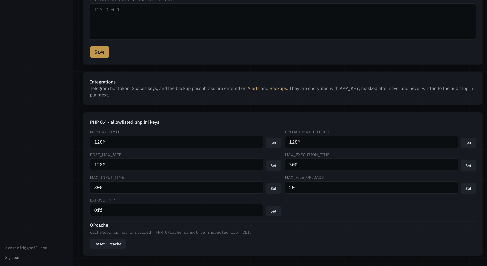

# LACMP Panel

A web control plane for [teddysun/lcmp](https://github.com/teddysun/lcmp)
(Linux + **Caddy** + MariaDB + PHP) and [teddysun/lamp](https://github.com/teddysun/lamp)
(Linux + **Apache** + MariaDB + PHP). The `lcmp` / `lamp` CLI stays the source of
truth; this panel is a scoped, authenticated UI in front of it.

The panel is **control-plane infrastructure**, not a user site. It installs
under `/usr/local/lib/lacmp-panel/` (never the www root). Caddy and Apache cannot
share `:80`/`:443` — install **one** stack per host.

## Prerequisites

- A supported OS: Ubuntu 22.04/24.04, Debian 11–13, or EL 8/9/10
- **LCMP or LAMP already installed** (`lcmp` or `lamp` on PATH, plus MariaDB,
  PHP-FPM, and Caddy *or* Apache). This installer will not install, stop, or
  reconfigure the stack, existing vhosts, MariaDB data, Redis, or your sites.

If neither command is present, `./lacmp_gui.sh` exits and prints both clone
options (`teddysun/lcmp` and `teddysun/lamp`).

## Default install (optional extras)

```bash
# as root, on the LCMP or LAMP host
git clone https://github.com/azerioid/lacmp_gui.git
cd lacmp_gui
chmod +x lacmp_gui.sh
./lacmp_gui.sh
```

With **no flags**:

- Preflight checks for **`lcmp` or `lamp`** (and Caddy or Apache, MariaDB, PHP-FPM)
- Stack is **`--stack=auto`**: prefer the web server bound to `:80`/`:443`
- Access is **tunnel** — `127.0.0.1:3169` only (SSH `-L`). Public HTTPS is
  **optional** (`--access=public`)
- On a TTY you can confirm tunnel vs public; Enter keeps the defaults
- Non-interactive (`--non-interactive` or no TTY) is tunnel on **3169**

Override the port with `--port=NNNN`. Force a stack with `--stack=lcmp` or
`--stack=lamp`.

`lacmp_gui.sh` is a thin preflight (OS gate, stack present, php-cli + composer).
All install logic is in `deploy/install.sh`.

### Access modes

| Mode | How you reach it | TLS | When to use |
| --- | --- | --- | --- |
| **tunnel** (default) | `ssh -L 3169:127.0.0.1:3169 user@host` then `http://127.0.0.1:3169` | localhost HTTP only | Safest. No public listener. |
| **public + domain** (optional) | `https://panel.example.com:PORT` | LCMP: Caddy ACME. LAMP: certbot on 443, else self-signed | DNS A record required. |
| **public + IP** (optional) | `https://<ip>:PORT` | LCMP: Caddy `tls internal`. LAMP: openssl self-signed | Browser shows an untrusted-cert warning. Traffic is still encrypted. |

Public mode **never** serves the panel over plaintext HTTP on a public interface.
By default it also enables **TOTP**, a **fail2ban** jail, and a firewall rule
(`--require-totp` / `--fail2ban` / `--firewall` can turn those off).

```bash
# Default: detect lcmp vs lamp, tunnel on 3169
./lacmp_gui.sh

# Explicit tunnel
./lacmp_gui.sh --access=tunnel --stack=auto

# Force Apache (LAMP) or Caddy (LCMP)
./lacmp_gui.sh --stack=lamp
./lacmp_gui.sh --stack=lcmp

# Custom port
./lacmp_gui.sh --port=4444

# Optional public IP mode (self-signed HTTPS)
./lacmp_gui.sh --access=public --port=3169 --ip=203.0.113.10

# Optional public domain mode (trusted cert)
./lacmp_gui.sh --access=public --domain=panel.example.com --port=3169 --le-email=you@example.com

# Non-interactive public (must pass --domain= or --ip=)
./lacmp_gui.sh --non-interactive --access=public --ip=203.0.113.10 --port=3169 --enable-ufw

# Apply: auto (default). none = write+validate only
./lacmp_gui.sh --caddy-reload=auto
./lacmp_gui.sh --caddy-reload=none
```

`./lacmp_gui.sh --help` lists every flag and default.

If ufw is installed but inactive, pass `--enable-ufw` so the installer can
enable it **after** allowing SSH/22.

The SSH-tunnel path on `127.0.0.1:<port>` (default 3169) stays available after
public mode on **Caddy**. On **Apache**, public mode binds HTTPS on that port
only (Apache cannot mix HTTP and HTTPS on the same port).

| Flag | Meaning |
| --- | --- |
| `--stack=auto\|lcmp\|lamp` | Detect or force the stack (default: **auto**) |
| `--access=tunnel\|public` | Access mode (default: **tunnel**; public is optional) |
| `--domain=` / `--ip=` | Public HTTPS identity |
| `--port=` | Panel listen port (default 3169; not 80/443) |
| `--allow-ip=` | Comma-list or repeatable CIDR allowlist |
| `--email=` / `--le-email=` | ACME email (domain mode) |
| `--caddy-reload=` | `auto` (default), `api`, `systemctl`, `restart`, `none` |
| `--require-totp=` | `true`/`false` (default true) |
| `--firewall=` / `--fail2ban=` | default true in public mode |
| `--php=8.4` | PHP version (default: newest FPM) |
| `--prefix=` / `--web-user=` | layout overrides |
| `--non-interactive` | no prompts; public requires `--domain` or `--ip` |
| `--dry-run` | print the plan; change nothing |
| `--reset-db` | Rotate panel DB users (destructive) |
| `--skip-caddy` | Do not write the panel Caddy/Apache vhost |
| `--enable-ufw` | Enable inactive ufw, keeping SSH |
| `--readonly-vhost=` | Extra read-only vhost name |

Re-run is safe: code is updated; `broker.json` / `APP_KEY` / DB passwords are
**not** rotated unless `--reset-db`. Reverse-proxy vhosts are re-detected and
marked read-only.

### First run

Open the panel and complete the **setup wizard** (admin email + strong password
+ TOTP). 2FA is required when `PANEL_REQUIRE_TOTP=true` (public mode default).
There is no `artisan` admin bootstrap.

### Install walkthrough (screenshots)

Screenshots from a fresh **LCMP** box (Ubuntu 24.04), in chronological order.
Files live in [`screenhoot/`](screenhoot/) as `NN-YYYY-MM-DD-HHMMSS.png`.

| # | Time | Step |
| --- | --- | --- |
| 1 | 16:57:35 | Clone [lacmp_gui](https://github.com/azerioid/lacmp_gui.git), `chmod +x lacmp_gui.sh`, first `./lacmp_gui.sh`. Preflight must find **`lcmp`** (teddysun Caddy CLI), not `lacmp`. |
| 2 | 16:57:43 | `git pull` after the stack-detection fix, then re-run the installer. |
| 3 | 16:58:43 | Interactive install — **tunnel** mode (default): port **3169**, TOTP optional. |
| 4 | 16:59:04 | Tunnel install finished. Reach the panel with `ssh -L 3169:127.0.0.1:3169 user@host` then `http://127.0.0.1:3169`. |
| 5 | 17:01:52 | Re-run installer — choose **public** access, blank domain (IP / self-signed), port **3169**. |
| 6 | 17:02:14 | Public Caddy apply can fail with `permission denied` on `/var/lib/caddy/.../root.crt` when internal PKI was created as **root** (pre-`af5f785`). |
| 7 | 17:02:42 | Recovery on old builds: `chown -R caddy:caddy /var/lib/caddy` and `systemctl restart caddy`, then re-run public install. Current `main` does this automatically. |
| 8 | 17:02:49 | Public HTTPS apply succeeds — Caddy binds the panel port (`tls internal`). |
| 9 | 17:03:42 | Browser: accept the self-signed cert warning, open `https://<ip>:3169`, complete setup / login. |



















Non-interactive public install (no prompts):

```bash
./lacmp_gui.sh --non-interactive --access=public --ip=<your-ip> --port=3169
```

Uninstall:

```bash
./deploy/uninstall.sh            # keeps the panel DB
./deploy/uninstall.sh --drop-db  # also drops lacmp_panel users/schema
```

Uninstall removes the panel prefix, FPM pool, sudoers, panel Caddy snippet or
Apache vhost (`a2dissite`), cron, fail2ban jail, and the panel firewall rule.
It never deletes vhosts or databases created through the panel.

## Privilege separation

1. **Web app** — PHP-FPM pool `lacmp-panel`, user `caddy`, `www-data`, or `apache`.
2. **Broker** — `/usr/local/lib/lacmp-panel/broker`, `root:root` mode `0750`.
   Enumerated actions, argv arrays (no shell). Secrets on stdin JSON.

sudoers (generated for the real web user + prefix):

```
caddy ALL=(root) NOPASSWD: /usr/local/lib/lacmp-panel/broker
```

MariaDB **admin** credentials live in `/etc/lacmp-panel/broker.json`
(`0600 root:root`). The web `.env` only has the limited `lacmp_panel` app user.

Layout:

```
/usr/local/lib/lacmp-panel/          0751 root:root
  broker                            0750 root:root
  src/                              0750 root:root
  web/                              0750 web-user
/etc/lacmp-panel/broker.json         0600 root:root
```

PHP-FPM on Debian/Ubuntu uses `ProtectSystem=full`. The installer adds a
systemd drop-in so FPM can write panel storage under `/usr/local/lib`.

## Isolation from existing sites

- The installer does not edit other files in `/etc/caddy/conf.d/` or Apache
  `sites-available` / `conf.d/vhost`.
- Reverse-proxy vhosts (`reverse_proxy` or `ProxyPass`) are marked **read-only**
  (detected at install). Add more with `--readonly-vhost=`.
- Config changes always **validate then reload**. Failure rolls the panel vhost
  back; other sites keep serving.
- Dedicated FPM pool and MariaDB database.

## Local development (Mac / Herd)

```bash
cd web
cp .env.example .env
# APP_ENV=local, APP_DEBUG=true, DB_CONNECTION=sqlite, BROKER_DRIVER=fake
php artisan key:generate
touch database/database.sqlite
php artisan migrate
npm install && npm run dev
```

`BROKER_DRIVER=fake` returns sample data shaped like the real broker.

## Tests

```bash
cd web
./vendor/bin/phpunit
```

## Troubleshooting

- **Neither lcmp nor lamp:** install [teddysun/lcmp](https://github.com/teddysun/lcmp)
  or [teddysun/lamp](https://github.com/teddysun/lamp) first, then re-run
  `./lacmp_gui.sh`.
- **Both commands present:** `--stack=auto` uses whoever is on `:80`/`:443`, or
  pass `--stack=lcmp` / `--stack=lamp`.
- **Caddy admin API connection refused (`dial tcp [::1]:2019`):** the installer
  probes `127.0.0.1` first and falls back to `systemctl reload` then
  `systemctl restart`. Re-run the installer; check `Caddy apply strategy`.
- **Apache not listening after public install:** public mode uses HTTPS-only
  `Listen PORT https` (do not mix HTTP and HTTPS on the same port). Re-run the
  installer.
- **HTTP 500 on first request:** FPM could not write under `/usr/local/lib`
  (`ProtectSystem=full`). Re-run the installer. The FPM drop-in only lists
  existing panel storage/log paths (never `/etc/caddy` — that 226/NAMESPACE
  on LAMP). Check `systemctl show phpX.Y-fpm -p ReadWritePaths`.
- **Validate failed:** the previous panel vhost is restored; other sites are
  unchanged.
- **Public IP mode cert warning:** expected (self-signed / `tls internal`). Use
  domain mode for a trusted certificate.
- **ufw inactive:** pass `--enable-ufw` or open the port yourself.

## Security follow-ups (not auto-fixed)

If MariaDB listens on `0.0.0.0:3306`, the dashboard flags it. Bind-to-localhost
is an explicit click in the UI, never automatic.

## Layout (repo)

```
lacmp_gui.sh           documented entry point
broker/               privileged CLI + unit tests
web/                  Laravel 12 panel
deploy/install.sh     only place with real install logic
deploy/uninstall.sh
deploy/fail2ban/      filter + jail (no secrets)
deploy/{caddy,php-fpm,sudoers.d,broker.json.example}
screenhoot/           install walkthrough PNGs (numbered by date/time)
README.md
```
